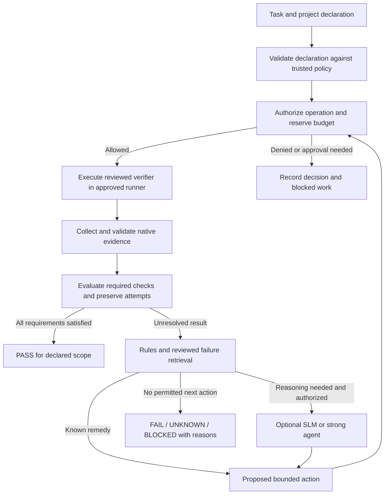

# Shared Architecture

Status: **Accepted target architecture**, 2026-09-10, through [ADR-0009](../decisions/ADR-0009-capability-verification-architecture.md). Implementation status is listed separately below.

## Scope and decision authority

B.I.M.A-DEV-INFRA is project-agnostic shared verification infrastructure. Projects own their application source, commands, domain assertions, architecture and incidents. Infrastructure owns reusable execution, policy, evidence and compatibility contracts.

The core uses small CLI modules invoked by Task and GitHub Actions. Logical layers are responsibility boundaries, not mandatory services. Local execution supports development; reviewed GitHub Actions workflows publish authoritative CI evidence. Specialized hardware/GUI evidence must identify its actual runner and cannot be inferred from generic CI success.

This document and [CAPABILITY-CONTRACT](CAPABILITY-CONTRACT.md) define the accepted target. [NEXT](../NEXT.md) defines delivery order. Issue #3 tracks work, #17 records the architecture proposal, #15 retains provider research, and #8/#9 track gated extensions. Historical proposals do not override the accepted ADR.

## Runtime flow



Authorization happens before every consequential operation, including a retry or patch. Verification runs within execution. After a proposed fix, the same gate controls a new verification sequence. A passing verification does not itself authorize release/publication.

## Responsibility map

| Boundary | Owns | Never substitutes for |
|---|---|---|
| Project contract | Required checks, commands, expected artifacts, environment constraints | Trusted execution permission |
| Policy and budget | Scope, approval, limits, deterministic decisions | OS/runner enforcement |
| Execution | Scoped process, timeout, isolation, cleanup, usage | Verification truth from a job exit alone |
| Verifier adapter | Interpret native results against declared assertions | Application-specific test design |
| Evidence | Subject identity, semantic result, native refs, history | Authentic producer proof from a hash alone |
| Failure routing | Exact rules, reviewed history, bounded relevant context | Automatic fix approval |
| Optional intelligence | Candidate diagnosis/action with evidence refs | Deterministic verdict or release authority |

## Implemented versus target

| Capability | Current baseline at `006d782` | Accepted next direction |
|---|---|---|
| Command surface | Task test/audit/evidence/packet/preflight/workflow checks | Reuse explicit implemented commands only |
| Verification | Beta repository hygiene plus additive Rust libtest normalization from a real AI-COLOR-COMPARE result; DEV-INFRA two-OS regression passes | Migrate one justified adapter at a time |
| Evidence | `bima-evidence.v1` remains active; `bima-verification-result.v2` pilot preserves attempts/counts and fail-closed unknowns | Hosted consumer PASS/FAIL and rollback proof before v2 activation |
| Failure routing | `bima-agent-packet.v1`; local exact-match known-failure classification with owner/reviewer, expiry and retry denial | Hosted consumer routing proof before integration or retry policy |
| Policy Gate | Strict v1 project/policy/request/decision validation and one bounded `repository-audit.v1` executor; DEV-INFRA two-OS evidence passed, consumer compatibility pending | Add operation classes only from measured consumers |
| Memory | Human-readable project/shared incident documents | Reviewed case records + rebuildable SQLite/FTS5 index |
| Models/context graph | No model runtime or Graphify integration | Optional measured experiments |
| Sandboxes/durable workflows/DB branching/security response | No shared implementation | Disabled until a real consumer demonstrates need |
| Repository governance | `main` branch protection verified active 2026-09-10; license remains unset | Select an explicit license and retain inspected enforcement |

Current evidence flow remains:

```text
repository audit result.json
  -> canonical.json + canonical.sha256
  -> execution.json (volatile metadata)
  -> packet.json only for fail/error
```

`pass` emits no packet. `fail` routes to machine. `error` marks agent eligibility only. No existing command launches a model. [EVIDENCE-CONTRACT](../standards/EVIDENCE-CONTRACT.md) and [AGENT-PACKET](../standards/AGENT-PACKET.md) remain the executable v1 definitions.

## Results and trust

Target aggregate verdicts are PASS, FAIL, UNKNOWN and BLOCKED for a declared required-check set. Flakiness is separately derived from equivalent attempt history. Preserve native outcomes, warnings, skips, waivers and all unresolved reasons. A successful normalization command is not proof the source check passed.

Only a complete verified required scope maps to a successful required CI check. A provider outage, missing evidence, exhausted budget or model absence cannot manufacture a pass. Optional context/memory/model failures may fall back to native tools within policy; all required checks still apply. See [CAPABILITY-CONTRACT](CAPABILITY-CONTRACT.md) for exact aggregation and migration rules.

## Knowledge and storage ownership

| Shared infrastructure | Owning project |
|---|---|
| Workflow/runner/evidence contracts and ADRs | Application/domain architecture and commands |
| Reusable failure schemas and reviewed cross-project patterns | Case details, private logs, expected artifact behavior |
| Benchmark protocol and approved reusable fixtures | Sensitive datasets, model caches, production data |

A lesson becomes shared only when its confirmed cause belongs to shared infrastructure or recurs in at least two projects. Mere symptom similarity is insufficient. Retained reviewed records need reproduction, scoped fix verification and provenance. SQLite is a derived local index; live databases/caches stay outside OneDrive/network sync folders. Replication is not immutable history or backup.

## Provider policy

Native search and reviewed incident records are the baselines. Graphify is a code-only context experiment. Local SLMs, sandbox providers, PostgreSQL branches, durable workflows, security-response systems and external project UIs remain optional. No candidate brand appears in mandatory core policy.

Build/sign/package transformations are explicitly linked by digest; release verification covers both provenance and behavior of the final distributed artifact. Release/signing/deployment remain separately authorized adapters. See the [plan audit](../audits/ARCHITECTURE-PLAN-AUDIT-2026-09-10.md) for the disposition of every plan and tool group.
