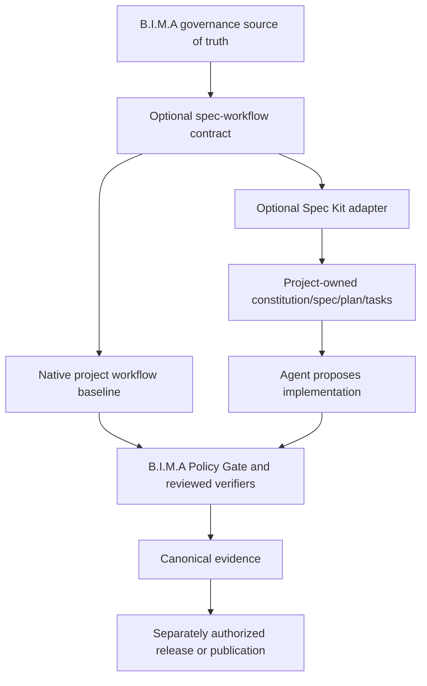

# Spec Kit adapter architecture audit

Outcome: **approve Spec Kit only as a gated, optional authoring adapter candidate. Do not make it B.I.M.A governance, verification, release, or execution authority. No adapter or consumer is active.**

## Scope and evidence snapshot

This audit evaluates the proposed relationship:

```text
B.I.M.A DEV governance
  -> Spec Kit constitution/specification/plan/tasks
  -> implementation
  -> B.I.M.A deterministic verification and ReleaseProof
```

The proposal is directionally correct but incomplete at the authority and supply-chain boundaries. The audit used [74 current sources](../research/SOURCES-SPEC-KIT-ADAPTER-2026-09-13.md), including the upstream stable `v1.0.6` snapshot at commit `96c9bd657bfd5de0d651a6165084932b7304ac99`, live issue discussions, platform security guidance, standards, and research abstracts. The local B.I.M.A baseline is `main` at `79c8e3efbed494f2c27b4b50cc8785614e56a6e6` before this documentation increment.

No Spec Kit command, installer, preset, extension, workflow, bundle, agent, or consumer migration was executed. This is an architecture and activation audit, not compatibility proof.

## Decision

### Accepted positioning



1. **B.I.M.A governance remains authoritative.** A Spec Kit constitution is a project-owned projection and supplement. It may strengthen local rules but cannot weaken, supersede, or self-approve changes to B.I.M.A governance.
2. **Spec Kit is an interchangeable authoring provider.** The shared contract describes required artifact identities and traceability. Native/manual workflows remain valid; Spec Kit cannot become a framework dependency of the verification core.
3. **Deterministic controls remain outside Spec Kit.** Spec, checklist, analysis, and implementation commands are agentic processes. They do not convert a generated document, checklist, or green provider job into verification evidence [S36-S46].
4. **The first candidate is a preset plus read-only validator, not an extension or executable workflow.** Upstream maintainers identify presets as the organization-governance composition layer [S23, S47-S48]. Extensions and workflows add hooks, prompts, and shell execution and therefore create a larger authority surface [S27, S31-S32].
5. **No consumer work starts from this audit.** Activation still requires the same reviewed unmet need in at least two distinct project repositories and a separately approved experiment request.

## Why the original diagram needs a boundary

The original diagram makes `implementation` appear to flow directly from Spec Kit. In `v1.0.6`, the workflow can invoke agents, prompts, shell steps, loops, and human gates [S27]. Codex integration materializes skills under `.agents/skills` and can dispatch `codex exec` [S20-S21]. These are consequential operations.

Therefore the correct boundary is:

```text
Spec Kit artifacts = authoring context and proposed work
B.I.M.A Policy Gate = operation authorization
reviewed verifier = truth evaluation
canonical evidence = retained proof
ReleaseProof = separate publication/behavior decision
```

Spec Kit may reduce forgotten files or ambiguity, but that benefit is not yet measured in B.I.M.A. Requirements research supports structured authoring and review potential, while also showing specification perception, controllability, false-positive, and verification limitations [S67-S74].

## Upstream fit and risks

| ID | Priority | Finding | Required response |
|---|---|---|---|
| SK01 | P1 | Spec Kit stable is now `v1.0.6`; six 1.0.x releases landed in about three weeks [S01, S03]. | Pin exact release and resolved commit; re-audit upgrades. |
| SK02 | P1 | Presets are the intended governance layer and support stacking/wrapping [S23-S25, S47-S48]. | Prototype a B.I.M.A-owned preset only after activation demand. Never fork core templates. |
| SK03 | P1 | Community extensions/presets are catalog entries, not upstream security endorsements [S22, S25, S53]. | Initial candidate may use bundled core plus a B.I.M.A-owned artifact only. |
| SK04 | P1 | Workflows may execute arbitrary prompts and shell steps [S27]. | Do not run Spec Kit workflows in trusted CI during phase 1. Separate authorization per operation. |
| SK05 | P1 | Codex integration installs behavioral skills into the consumer [S20-S21]. | Treat installed skills as executable dependencies; preserve hashes and reviewed diffs. |
| SK06 | P1 | Bundle installation can leave partial disk state after best-effort rollback, and existing components may skip pin comparison [S28]. | Do not use bundles initially; validate exact on-disk composition digest. |
| SK07 | P1 | Materialized constitution propagation duplicates authority and can drift or be clobbered [S34-S35]. | Do not use `constitution-sync`; prefer runtime composition plus a separate B.I.M.A drift report. |
| SK08 | P1 | `--force` can overwrite modified managed files [S09, S20]. | Prohibit force flags in any trusted adapter. Require clean checkout and reviewed changes. |
| SK09 | P2 | Upstream's own constitution dogfooding is still an open/stale proposal [S49]. | Do not claim mature upstream proof of constitution governance. |
| SK10 | P2 | A constitution report lifecycle bug required clarification in `v1.0.6` [S50-S51]. | Reject committed temporary reports and measure context growth. |
| SK11 | P1 | Prompt-based analysis can report clean while examining little; community evidence explicitly calls for coverage counts [S52]. | Every B.I.M.A traceability result records inspected, recognized, unresolved, and excluded counts. |
| SK12 | P1 | Spec Kit needs Python 3.11+ and runtime packages [S05]. | Keep it outside the language-neutral core and runner baseline. |
| SK13 | P2 | Private catalogs introduce credentials [S29]. | Initial candidate is public/offline and requests no credentials or network at runtime. |
| SK14 | P2 | One default integration controls composition [S20]. | Initial candidate supports one declared agent integration; switching is an explicit reviewed change. |

## Proposed optional contract

The contract name is provisional: `bima-spec-workflow.v1`. It is not implemented by this audit.

### Consumer-owned inputs

```text
.bima/spec-workflow.json
.specify/memory/constitution.md
specs/<feature>/spec.md
specs/<feature>/plan.md
specs/<feature>/tasks.md
project architecture, ADRs, tests, and implementation
```

Minimum declaration:

- provider (`native` or `spec-kit`);
- exact Spec Kit version, resolved source revision, and package/artifact digest;
- exact B.I.M.A governance reference and digest;
- active integration and full preset composition order/digests;
- project/feature/source revision identity;
- required artifact set and allowed optional stages;
- evidence sensitivity and retention policy;
- no-network/no-credential default;
- requested operation, which is authorization input rather than permission.

### Shared adapter outputs

```text
spec-workflow-result.json
traceability.json
composition.json
drift-report.md
native command/version logs
```

The result records:

- exact subject and provider identity;
- every artifact byte digest;
- requirement -> plan -> task -> changed-file -> required-check links;
- inspected/recognized/unresolved/excluded counts;
- missing, duplicate, contradictory, stale, and unapproved-governance findings;
- temporary/generated files that must not be committed;
- provider composition and upgrade drift;
- deterministic `PASS | FAIL | UNKNOWN | BLOCKED` for the declared validation scope.

A successful adapter invocation only means the declared artifact contract passed. It does not prove the feature, build, test, package, or release passed.

### Permissions and runner

Initial validator permissions:

```text
repository contents: read
network: none during validation
credentials: none
write scope: one fresh evidence directory
agent/model execution: none
project commands: none
release/publish: none
```

The validator may inspect a clean checkout and pinned tool/package bytes. It must not call `/speckit.implement`, `/speckit.converge`, arbitrary Spec Kit workflows, project build commands, Git writes, issue creation, or publication. Those are separately authorized operations.

## Pilot and benchmark gate

The candidate remains `BLOCKED` until two independent project owners record the same unmet authoring/traceability need. A declaration alone is demand evidence, not approval to install or run the provider.

After demand exists, use paired tasks in at least two projects:

```text
Baseline: existing B.I.M.A rules + native planning
Candidate: same B.I.M.A rules + pinned Spec Kit + B.I.M.A preset
Both: same task brief, acceptance checks, verifier, reviewer, and evidence policy
```

Pre-register these measures before seeing candidate results:

| Measure | Meaning |
|---|---|
| Acceptance pass rate | Required project checks satisfied on first reviewed submission and after all attempts. |
| Missing-artifact rate | Required files/checks omitted from the proposed change. |
| Traceability coverage | Requirements with valid plan, task, change, and check links, plus explicit denominator. |
| Contradiction/stale rate | Conflicts and stale spec/code links confirmed by review. |
| False-block rate | Validator/agent findings rejected by the reviewer. |
| Security exceptions | Policy bypass, unexpected network/credential/write, or unpinned content; acceptance threshold is zero. |
| Time and tokens | End-to-end authoring, review, correction, and verification cost—not generation time alone. |
| Upgrade burden | Files changed, conflicts, manual corrections, and drift after one pinned-version upgrade rehearsal. |

Acceptance thresholds belong in the reviewed experiment request after baseline collection. The experiment must reject the provider if it creates any authority bypass or if measured quality improvement does not justify total time/token/maintenance cost.

## Roadmap disposition

```text
NOW
  documentation-only audit and source ledger

BLOCKED
  two-project demand
  baseline tasks and approved thresholds
  exact package/preset provenance

PILOT 1
  read-only artifact/composition validator
  no agent, shell workflow, network, credential, or consumer rollout

PILOT 2
  B.I.M.A-owned preset in isolated fixtures
  native baseline comparison + upgrade rehearsal

OPTIONAL ADOPTION
  per-project opt-in only
  reviewed pin + rollback
  deterministic B.I.M.A gates remain authoritative
```

No ADR is accepted yet because the provider has no two-project demand or comparative benchmark. [ADR-0009](../decisions/ADR-0009-capability-verification-architecture.md) already defines the correct provider-neutral boundary. If the pilot passes, a new ADR should record only the optional adapter contract and activation conditions; it must not replace ADR-0009 or elevate Spec Kit into the core.

## Final verdict

The strongest form of the proposal is:

> **B.I.M.A DEV menentukan hukum, izin, dan bukti. Spec Kit dapat menjadi salah satu cara opsional untuk menyusun pekerjaan.**

Adopting Spec Kit as mandatory infrastructure now would violate the repository's framework-neutral and measured-consumer rules. Rejecting it entirely would ignore a now-mature composition mechanism that maps well to optional organizational presets. The evidence supports a gated adapter candidate, not deployment.

## Local validation

| Check | Actual result | Scope |
|---|---|---|
| Source ledger structure | **PASS**: 74 sequential rows, 74 distinct URLs | Count and uniqueness only; not a runtime/provider benchmark |
| Existing regression suite | **PASS**: 111 passed, 1 skipped in 55.293 seconds | Skip: Windows denied symlink creation; not counted as pass |
| Repository audit | **PASS**: 148 files, 170 local links, 0 findings | Dirty documentation working tree at base `79c8e3e`; external URLs are not fetched by this auditor |
| Patch whitespace | **PASS** | `git -c pager.diff=false diff --check` |
| Runtime/consumer | **NOT RUN** | Deliberately excluded by the audit scope |

The first audit invocation supplied a nonexistent `config/audit-policy.json` and correctly returned `ERROR`, `files=0`, one finding. The corrected invocation omitted that unsupported path, used the auditor's built-in policy, and produced the passing result above. The failed attempt is not represented as validation evidence.

## Sources

Full numbered source inventory and limitations: [Spec Kit adapter source ledger](../research/SOURCES-SPEC-KIT-ADAPTER-2026-09-13.md).
